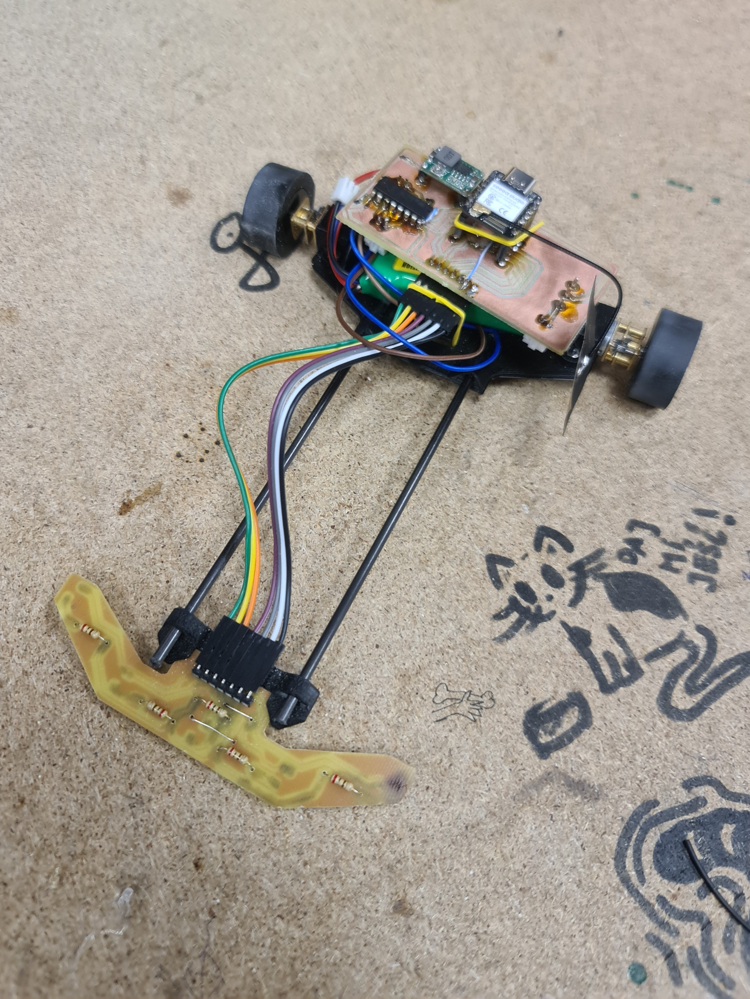

## BSR_Linefollower_23
Linefollower robot built in 3 days for a student's hackathon at BSR in our (teachers') free time. Features a simple web server for fine tuning the PD controller values on-the-go.
 
### Authors:  
rureq  
Gawron52  
 
### Hardware:  
- Two custom made (CNC milled) PCBs featuring:
  - Seeeduino Xiao esp32s3
  - L298N Motor controller
  - Step down converter mini 360
  - 5x KTIR sensors
- 2x N20-BT16 micro 10:1 2000RPM 9V motors
- 2x Solarbotics RW2i wheels
- ~500 mAh 7,4V battery made of single-use e-cigarette batteries and a BMS module
- 3D printed parts and carbon fiber rods
- Jumper cables
  
